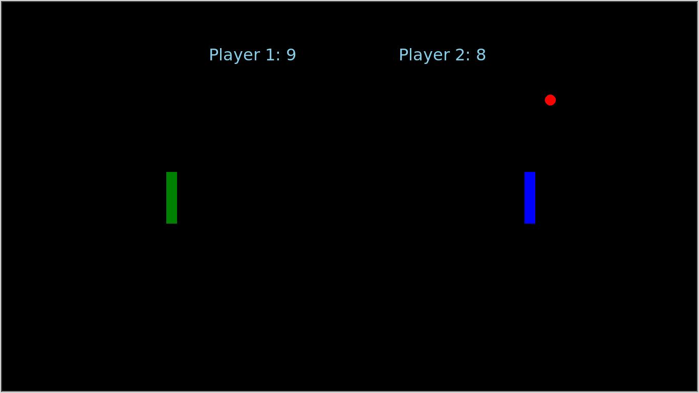

# PONG-x

## Dependencies:

1. Python v3.x
2. turtle
3. playsound

This is multiplayer pong game built on the turtle module. Two plays can play at a time. You can simply run the file to play the game. First pip install the turtle package to the game.

## Project setup
```sh
pip install turtle playsound
```
### runs code
```sh
python main.py
```
### kills running code
```sh
Ctrl + C
```
## Controls

### Arrow Keys for Direction:

#### For Player 1:

To move paddle up press 'A'

To move paddle down press 'Z'

#### For Player 2:

To move paddle up press 'UP_ARROW'

To move paddle down press 'DOWN_ARROW'

## Play as an executable

Here you have the option of installing the executable. Make sure you have your ssh keys set up with github.

```sh
git clone git@github.com:BGTECH-PRO/pong-x.git && cd pong-x
```
Now you can click on the executable named main and enjoy pong.
